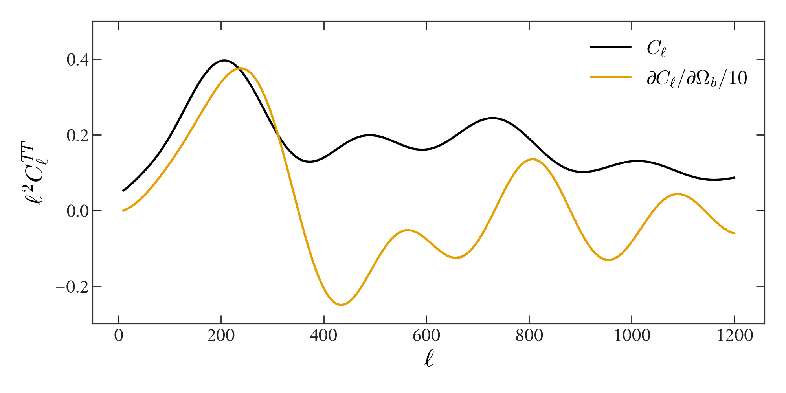
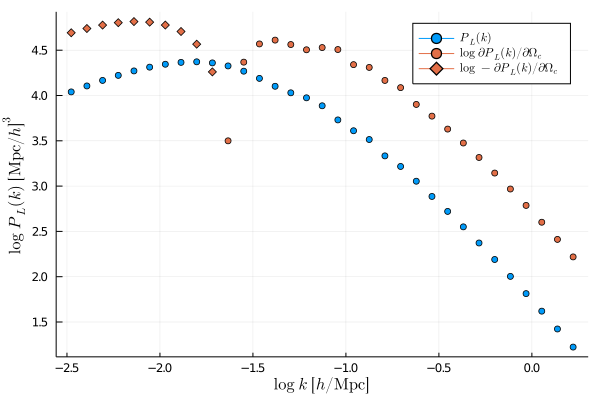

# Bolt

[](https://xzackli.github.io/Bolt.jl/dev)
[](https://github.com/xzackli/Bolt.jl) 

[](https://github.com/xzackli/Bolt.jl/actions)
[](https://codecov.io/gh/xzackli/Bolt.jl)

⚡ Bolt is a pure-Julia integrator for the Boltzmann equations in cosmology. It can accurately compute the gradient of the CMB power spectrum, with respect to cosmological parameters, using forward-mode automatic differentiation.

**Contributors**: Jamie Sullivan, Zack Li, Marius Millea

## Install

Bolt requires Julia 1.5+. To install, from the package prompt, run:

```
pkg> add https://github.com/xzackli/Bolt.jl
```

## Gallery

*A CMB temperature power spectrum and gradient from Bolt.jl.*
 

*A linear matter power spectrum and gradient from Bolt.jl.*
 


