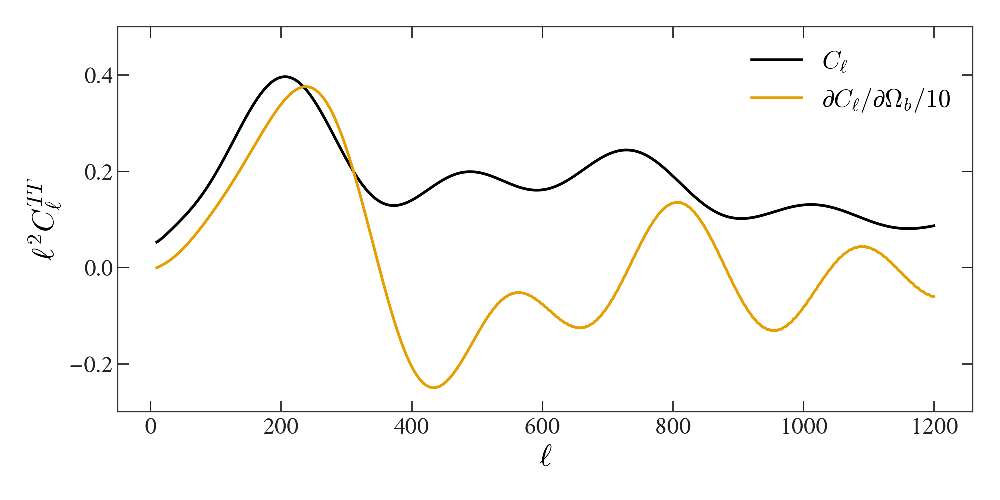

# Bolt

[](https://xzackli.github.io/Bolt.jl/stable)
[](https://xzackli.github.io/Bolt.jl/dev)
[](https://github.com/xzackli/Bolt.jl/actions)
[](https://codecov.io/gh/xzackli/Bolt.jl)

⚡ Bolt is a pure-Julia integrator for the Boltzmann equations in cosmology. It can accurately compute the gradient of the CMB power spectrum, with respect to cosmological parameters, using forward-mode automatic differentiation.

It's currently implementing the simplest possible hierarchy (photons, baryons, dark matter) with only hydrogen Peebles recombination. It needs a fair bit more physics before it can be applied to modern data. There are some examples showing accurate reproduction of some figures in `examples/`.

<p align="center">

</p>
*A CMB temperature power spectrum and gradient from Bolt.jl.*

## Example / Performance

```julia
using Bolt
using ForwardDiff

# Cₗ₌₁₀₀ function of baryon density
function cl100(Ω_b::DT) where DT
    par = CosmoParams{DT}(Ω_b=Ω_b)
    bg = Background(par)
    ih = IonizationHistory(Peebles(), par, bg)
    k_grid = quadratic_k(0.1bg.H₀, 1000bg.H₀, 100)
    sf = sourcefunction(par, bg, ih, k_grid, BasicNewtonian())
    return cltt(100, par, bg, ih, sf)
end

Δ = 1e-3
print("Result Comparison: ",
    (cl100(0.046 + Δ) - cl100(0.046 - Δ)) / 2Δ, " ",
    ForwardDiff.derivative(cl100, 0.046), "\n")

using BenchmarkTools
print("Simple Finite Difference:\n")
@btime (cl100(0.046 + Δ) - cl100(0.046 - Δ)) / 2Δ
print("ForwardDiff:\n")
@btime ForwardDiff.derivative(cl100, 0.046)
```

```
Result Comparison: 0.00012423928229756477 0.00012423371182564182

Simple Finite Difference:
  13.539 s (26365268 allocations: 2.52 GiB)
ForwardDiff:
  11.160 s (29920717 allocations: 4.97 GiB)
```